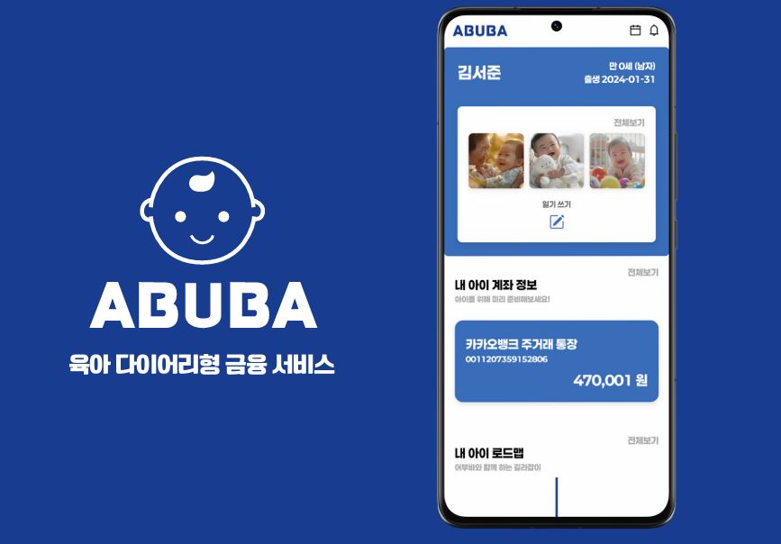
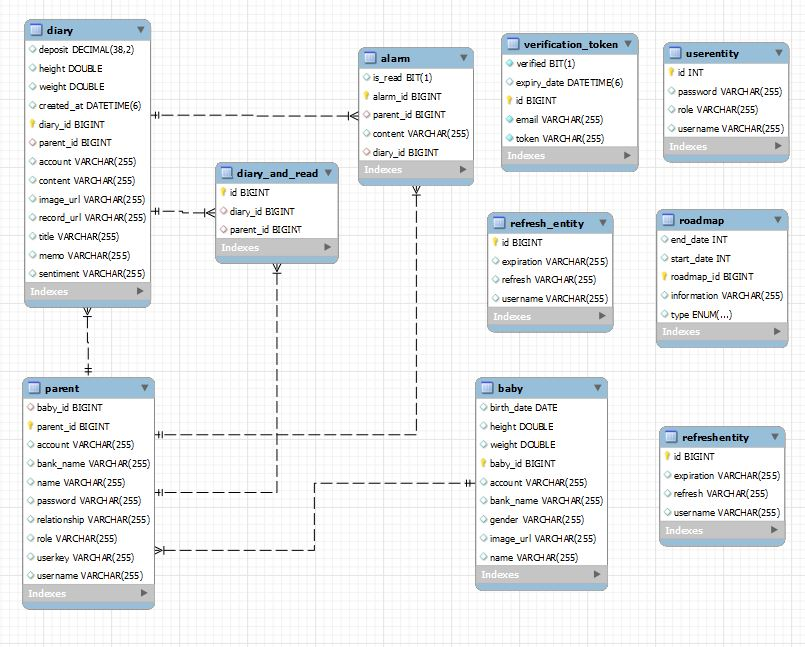
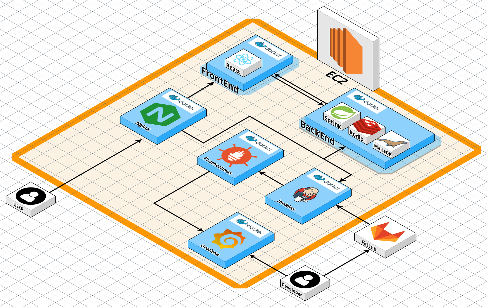
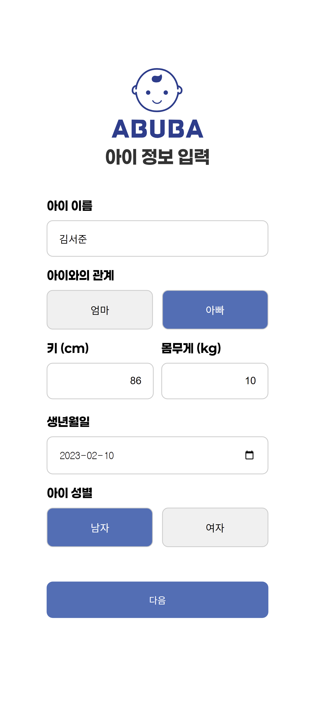
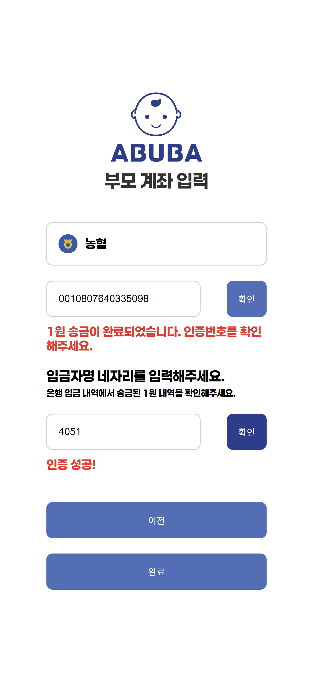
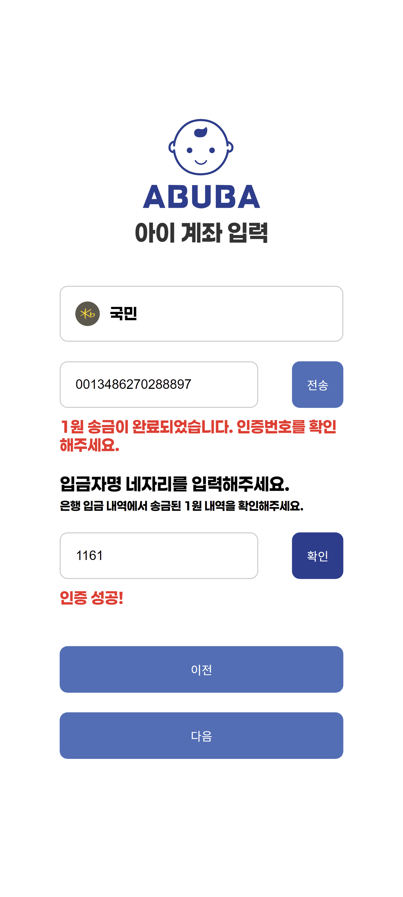
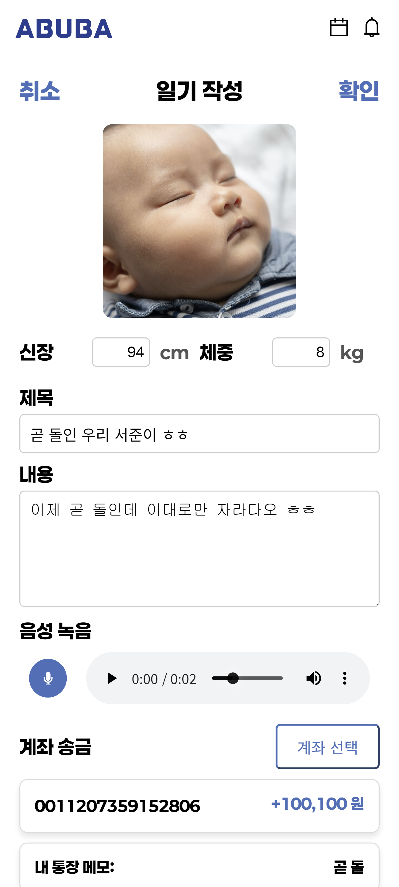
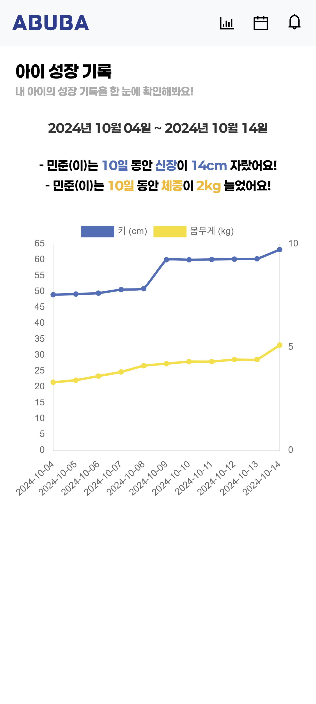
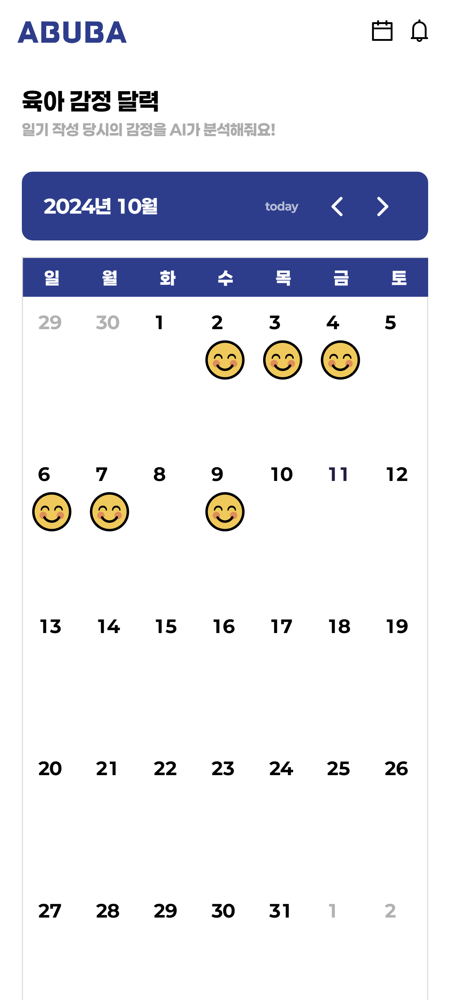
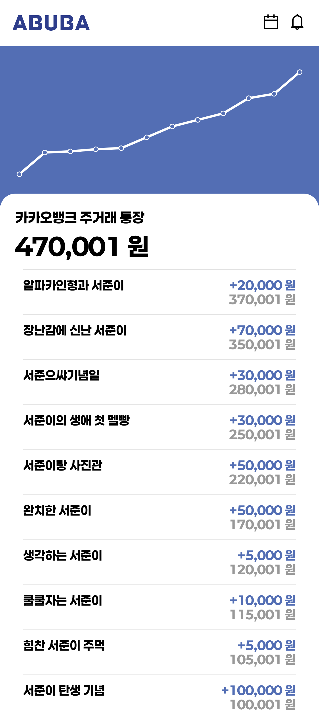

# 👶 ABUBA - 육아 다이어리형 금융 서비스
<hr>



## 💡 ABUBA는 어떤 서비스인가요?
<hr>
아이의 성장을 더 특별하게 기록하고 싶나요? 그렇다면 **ABUBA**를 소개합니다!

**ABUBA**는 육아와 금융을 결합한 새로운 서비스입니다. 부모님이 아이의 일상을 육아 일기로 기록하는 동시에, 아이의 미래를 위한 저축을 관리할 수 있습니다. 아이의 첫 미소, 첫 걸음, 첫 마디, 그 모든 소중한 순간을 간직하면서 미래를 위한 준비도 함께 할 수 있어요.

부모님은 아이의 사진과 음성 기록을 남길 수 있고, AI가 감정 분석을 통해 일기를 더욱 생동감 있게 정리해 줍니다. 뿐만 아니라, 아이의 계좌와 연동되어 저축 상황을 한눈에 확인하고, 목표 금액에 도달하면 특별한 기념일처럼 육아 기록을 모아 선물할 수도 있어요.

**ABUBA**와 함께라면, 아이의 성장과 함께하는 매일이 특별한 추억이 됩니다!

## 📆 프로젝트 기간
<hr>

2024.08.19(월) ~ 2024.10.11(금)

## 🏃 팀원 소개
<hr>

### Backend
|  |  |  |
|:--------------------------------------------------------------:|:--------------------------------------------------------------:|:--------------------------------------------------------------:|
|                              최재혁                               |                              이동규                               |                              김재윤                               |

### Frontend
|  |  |
|:--------------------------------------------------------------:|:--------------------------------------------------------------:|
|                              정승훈                               |                              유태람                               |

### Infra
|  |
|:--------------------------------------------------------------:|
|                              김영표                               |

## 🛠️ 메인 기능
<hr>

- ### 육아 일기 & 성장 기록
    - 아이의 소중한 순간들을 사진과 음성으로 기록할 수 있어요. 예를 들어, 아이가 처음으로 걷는 순간이나 첫 번째 생일을 일기로 남기고, 감정 달력으로 그 날의 기분을 시각화할 수 있어요
    - AI 감정 분석 기능을 통해 일기 작성자의 감정 상태를 분석하고 이모지로 표현하여, 육아 기록을 더 다양하게 간직할 수 있어요
    - 일기 기록을 바탕으로 성장 기록 차트가 자동으로 업데이트되어, 아이의 키, 몸무게 등 발달 상황을 한눈에 확인할 수 있어요
      <br/>
- ### 금융 서비스와 연동
    - 아이의 미래를 위한 저축을 간편하게 관리하세요. 부모님이 연동된 계좌로 아이의 저축 상황을 관리하고, 목표 저축 금액을 설정할 수 있어요
    - 일기 메모에 맞춰 입출금 내역을 자동으로 연결해 육아와 저축을 한 번에 관리하는 스마트한 방법을 제공합니다
      <br/>
- ### 맞춤형 육아 로드맵
    - 아이의 나이에 맞춰 개인화된 정보를 제공합니다. 각 성장 단계에 맞는 발달 정보, 정부 지원 혜택, 의료 정보 등을 쉽게 확인할 수 있어요
    - 아이의 성장에 맞춘 정보를 기반으로 필요한 육아 정보를 언제든지 받아볼 수 있어, 부모님의 육아 고민을 덜어줍니다
      <br/>
- ### 가족 간 공유와 소통
    - 가족 구성원들이 함께 작성한 일기를 공유하고, 서로의 기록을 확인하며 아이의 성장을 함께 축하할 수 있어요
    - 특정 가족 구성원이 기록한 일기가 게시되면, 실시간 알림을 통해 다른 가족들도 그 순간을 바로 확인할 수 있습니다
    - 작성된 일기는 다른 가족 구성원들도 볼 수 있어, 모두가 함께 아이의 성장을 축하하는 데 기여할 수 있어요
      <br/>

## 📜 주요 기술
<hr>

## 🖥️ Client

| 역할 | 종류 |
|------|------|
| Framework |  |
| Programming Language |  |
| Styling |  |
| State Management |  |
| Version Control |   |
| IDE |  |
| Web App |  |

## 🖧 Server

| 역할 | 종류 |
|------|------|
| Programming Language |  |
| Framework |   |
| Authentication |   |
| Database |   |
| Cloud & SDK |   |
| Build Tool |  |
| Real-time Communication |  |
| API Client |  |

## 🏗️ Infrastructure

| 역할 | 종류 |
|------|------|
| Web Server |  |
| Containerization |  |
| CI/CD |  |
| Cloud Services |   |

## 📠 협업 툴

| 도구 | 용도 |
|------|------|
|  | 버전 관리 및 CI/CD |
|  | 프로젝트 관리 및 이슈 트래킹 |
|  | 문서화 및 지식 관리 |
|  | 팀 커뮤니케이션 |
|  | 음성 채팅 및 실시간 협업 |
|  | 화상 회의 및 원격 협업 |

## 📝 ERD Diagram
<hr>



## 🎨 System Architecture
<hr>



## 📁 프로젝트 파일 구조도
<hr>

### Backend
```
backend
└───src
    ├───main
    │   ├───java
    │   │   └───com
    │   │       └───hexagon
    │   │           └───abuba
    │   │               ├───account
    │   │               │   ├───controller
    │   │               │   ├───dto
    │   │               │   │   ├───request
    │   │               │   │   └───response
    │   │               │   └───service
    │   │               ├───alarm
    │   │               │   ├───controller
    │   │               │   ├───entity
    │   │               │   ├───repository
    │   │               │   └───service
    │   │               ├───auth
    │   │               │   ├───config
    │   │               │   ├───controller
    │   │               │   ├───dto
    │   │               │   │   ├───request
    │   │               │   │   └───response
    │   │               │   ├───entity
    │   │               │   ├───jwt
    │   │               │   ├───repository
    │   │               │   └───service
    │   │               ├───common
    │   │               ├───diary
    │   │               │   ├───controller
    │   │               │   ├───dto
    │   │               │   │   ├───request
    │   │               │   │   └───response
    │   │               │   ├───entity
    │   │               │   ├───repository
    │   │               │   └───service
    │   │               ├───global
    │   │               │   ├───exception
    │   │               │   └───openfeign
    │   │               │       └───dto
    │   │               │           ├───request
    │   │               │           └───response
    │   │               ├───roadmap
    │   │               │   ├───controller
    │   │               │   ├───dto
    │   │               │   │   └───response
    │   │               │   ├───repository
    │   │               │   └───service
    │   │               ├───s3
    │   │               │   └───service
    │   │               └───user
    │   │                   ├───controller
    │   │                   ├───dto
    │   │                   │   ├───request
    │   │                   │   └───response
    │   │                   ├───repository
    │   │                   └───service
    │   └───resources
    │       └───templates
    └───test
        └───java
            └───com
                └───hexagon
                    └───abuba
```
### Frontend
```
frontend
└───src
    ├───api
    ├───assets
    │   ├───fonts
    │   └───images
    ├───components
    │   ├───account
    │   ├───buttons
    │   ├───calendar
    │   ├───deposit
    │   ├───graph
    │   ├───layouts
    │   ├───login
    │   ├───main
    │   ├───onboardinginfo
    │   ├───rodamap
    │   └───signup
    ├───config
    ├───mocks
    ├───pages
    │   ├───account
    │   ├───calendar
    │   ├───diary
    │   ├───graph
    │   └───roadmap
    ├───stores
    ├───styles
    ├───types
    └───utils

```

## 🖥️ ABUBA 서비스 화면
<hr>

- ### 회원 관리
    - #### 아이 정보 입력
    

    - #### 부모 계좌 인증
    
    
    - #### 아이 계좌 인증
    
    
- ### 메인 페이지
  - #### 시작 화면
    
 
- ### 육아 일기
    - #### 일기 작성
    

    - #### 일기장
    

- ### 성장 기록 & 감정 달력
    - #### 성장 기록 차트
    

    - #### 감정 달력
    

- ### 계좌 상세 정보
    - #### 계좌 이체 내역 & 일기 메모 조회
    
