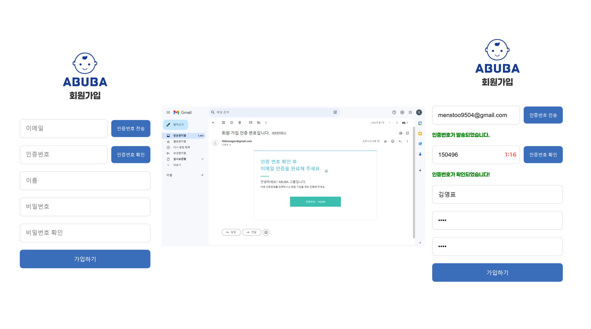
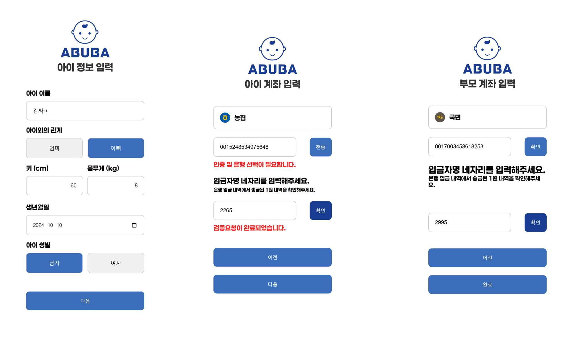

# 포팅 메뉴얼

소유자: 영표 김

# 프로젝트 사용 도구

---

- 이슈 관리 : JIRA
- 형상 관리 : GitLab
- 커뮤니케이션 : Notion, Mattermost
- 디자인 : Figma
- UCC : Luma AI
- CI/CD : Jenkins

# 개발환경

---

- Server : AWS EC2 Ubuntu 20.04.6 LTS
- VS Code : 1.90.2
- IntelliJ : 17.0.11+1-b1207.24 amd64
- JVM : 17.0.12
- Node.js : 20.17.0
- DB : MySQL
- Spring : 3.3.3

# 외부 서비스

---

- AWS S3 : .env에 해당 내용 있음 (과금이 발생할 수 있는 키입니다.)
- AI NAVER CLOVA Sentiment : .env에 해당 내용 있음 (과금이 발생할 수 잇는 키입니다.)

# Build & Deploy

---

## 환경 변수 정리

1. Backend .env
    
    ```yaml
    AWS_ACCESS_KEY={AWS S3 엑세스 키}
    AWS_SECRET_KEY={AWS S3 시크릿 키}
    CLIENT_ID={NAVER CLOVA Client id}
    CLIENT_SECRET={NAVER CLOVA 시크릿 키}
    ```
    
2. Backend application.yml
    
    ```yaml
    spring:
      application:
        name: abuba
      profiles:
        active: prod
      jwt:
        secret: spring.jwt.secret={JWT 시크릿}
      jpa:
        properties:
          hibernate:
            dialect: org.hibernate.dialect.MySQLDialect
    
    springdoc:
      swagger-ui:
        path: /swagger # Swagger UI를 표시할 커스텀 경로
      api-docs:
        path: /docs  # API 문서 경로를 커스텀
    
    accountNo1: {계좌 번호}
    accountNo2: {계좌 번호}
    
    api:
      key: {SSAFY 핀테크 API 키}
    user:
      key: {SSAFY 핀테크 유저 키}
    #security log
    logging:
      level:
        org.springframework.security: DEBUG
        org.springframework.security.web.access: DEBUG
        org.springframework.security.authentication: DEBUG
    ```
    
3. Backend application-prod.yml
    
    ```yaml
    spring:
      datasource:
        username: {DB root username}
        password: {DB root password}
        url: jdbc:mysql://mysql:3306/{DB name}
        driver-class-name: com.mysql.cj.jdbc.Driver
    
      mail:
        host: smtp.gmail.com
        port: 465
        username: 106hexagon@gmail.com
        password: kpmk utrt asla pelt
        properties:
          mail.smtp.auth: true
          mail.smtp.starttls.enable: true
    
      jpa:
        hibernate:
          ddl-auto: update
    
      servlet:
        multipart:
          enabled: true
          max-request-size: 300MB
          max-file-size: 50MB
    
    aws:
      s3:
        access-key: ${AWS_ACCESS_KEY}
        secret-key: ${AWS_SECRET_KEY}
        bucket-name: {AWS S3 Bucket name}
        region: ap-northeast-2
    
    naver:
      client-id: ${CLIENT_ID}
      client-secret: ${CLIENT_SECRET}
    
    #ec2 주소
    app:
      email:
        verification-url: http://localhost:8080/api/v1/auth/verify-email
    ```
    
4. Frontend .env
    
    ```yaml
    REACT_APP_API_URL='{도메인}'
    DISABLE_ESLINT_PLUGIN=true
    ```
    

## CI/CD 구축

1. Docker 설치
    - 우분투 시스템 패키지 업데이트
    
    ```yaml
    sudo apt-get update
    sudo apt-get install ca-certificates curl
    sudo install -m 0755 -d /etc/apt/keyrings
    ```
    
    - Docker의 공식 GPG키를 추가
    
    ```yaml
    sudo curl -fsSL [https://download.docker.com/linux/ubuntu/gpg -o etc/apt/keyrings/docker.asc](https://download.docker.com/linux/ubuntu/gpg%20-o%20etc/apt/keyrings/docker.asc)
    sudo chmod a+r /etc/apt/keyrings/docker.asc
    ```
    
    - Docker의 공식 apt 저장소를 추가
    
    ```yaml
    echo \ "deb [arch=$(dpkg --print-architecture) signed-by=/etc/apt/keyrings/docker.asc] https://download.docke $(. /etc/os-release && echo "$VERSION_CODENAME") stable" | \ sudo tee /etc/apt/sources.list.d/docker.list > /dev/null
    sudo apt-get update
    ```
    
    - Docker 패키지 설치
    
    ```yaml
    sudo apt-get install docker-ce docker-ce-cli containerd.io docker-buildx-plugin docker-compose-plugin
    ```
    
    - 설치확인
    
    ```yaml
    sudo docker run hello-world
    ```
    
2. Docker Compose 설치
    - docker-compose 설치
    
    ```yaml
    sudo curl -SL https://github.com/docker/compose/releases/download/v2.28.1/docker-compose-linux-x86_64 -o /usr/local/bin/docker-compose
    ```
    
    - docker-compose 권한 부여
    
    ```yaml
    sudo chmod +x /usr/local/bin/docker-compose
    ```
    
    - docker-compose 심볼릭 링크 지정
    
    ```yaml
    sudo ln -s /usr/local/bin/docker-compose /usr/bin/docker-compose
    ```
    
    - 정상 설치 확인
    
    ```yaml
    docker-compose –v
    ```
    
3. Jenkins 설치
    
    ```yaml
    docker run -d --name jenkins \ 
    -e TZ=Asia/Seoul \ 
    -u root \ 
    -p 9090:8080 \ 
    -v /var/jenkins_home:/var/jenkins_home \ 
    -v /var/run/docker.sock:/var/run/docker.sock \ 
    -v /usr/bin/docker:/usr/bin/docker \ 
    jenkins/jenkins:latest-jdk17
    
    ```
    
4. Jenkins Plugin 설치
    
    [GitLab버전1.9.3](https://plugins.jenkins.io/gitlab-plugin)
    
    [Gradle Plugin버전2.13](https://plugins.jenkins.io/gradle)
    
    [Mattermost Notification Plugin버전3.1.3](https://plugins.jenkins.io/mattermost)
    
    [NodeJS Plugin버전1.6.2](https://plugins.jenkins.io/nodejs)
    
    [Pipeline Graph Analysis Plugin버전216.vfd8b_ece330ca_](https://plugins.jenkins.io/pipeline-graph-analysis)
    
    [Pipeline Graph View버전340.v28cecee8b_25f](https://plugins.jenkins.io/pipeline-graph-view)
    
    [SSH Agent Plugin버전376.v8933585c69d3](https://plugins.jenkins.io/ssh-agent)
    
    [SSH server버전3.330.vc866a_8389b_58](https://plugins.jenkins.io/sshd)
    
5. Jenkins Pipeline 작성
    
    ```bash
    pipeline {
        agent any
        
        stages {
            stage('git-clone') {
                steps {
                    echo '<---------------------------------------Clone Started!--------------------------------------->'
                    git branch: 'master', credentialsId: 'jenkins', url: '{GitLab URL}'
                    echo '<---------------------------------------Clone Success!--------------------------------------->'
                }
            }
            stage('build-backend') {
                steps {
                    echo '<---------------------------------------Build BackEnd--------------------------------------->'
                    dir('{Jenkins workspace directory}'){
                        sh '''
                        chmod +x gradlew
                        ./gradlew -x test clean build
                        '''
                    }
                    echo '<---------------------------------------Backend Build Success!--------------------------------------->'
                }
            }
            
            stage('deploy-backend'){
                steps {
                    echo '<---------------------------------------Deploy Backend--------------------------------------->'
                    sh '''
                    ssh {EC2 URL} '
                    cd {Backend Docker, Docker compose file DIR}
                    sudo cp {JAR file DIR} .
                    sudo docker compose --env-file ./.env up --build -d'
                    '''
                    echo '<---------------------------------------Backend Deploy Success!--------------------------------------->'
                }
            }
            
            stage('build-frontend'){
                environment {
                    REACT_APP_API_URL='{Domain URL}'
                    DISABLE_ESLINT_PLUGIN=true
                }
                steps {
                    echo '<---------------------------------------Build Frontend--------------------------------------->'
                    dir('{Jenkins workspace directory}') {
                        nodejs(nodeJSInstallationName: 'NodeJS_20.17') {
                            sh '''
                            npm install
                            npm run build
                            '''
                        }
                    }
                    echo '<---------------------------------------Frontend Build Success!--------------------------------------->'
                }
            }
            
            stage('deploy-front'){
                steps {
                    echo '<---------------------------------------Deploy Frontend--------------------------------------->'
                    sh '''
                        ssh {EC2 URL} '
                        sudo cp -a {EC2 Frontend Build file DIR} {NginX DIR}
                        sudo docker restart nginx'
                    '''
                    echo '<---------------------------------------Frontend Deploy Success!--------------------------------------->'
                }
            }
            
            post {
                success {
                    script {
                        def Author_ID = sh(script: "git show -s --pretty=%an", returnStdout: true).trim()
                        def Author_Name = sh(script: "git show -s --pretty=%ae", returnStdout: true).trim()
                        mattermostSend(color: 'good',
                            message: "빌드 성공: ${env.JOB_NAME} #${env.BUILD_NUMBER} by ${Author_ID}(${Author_Name})\n(<${env.BUILD_URL}|Details>)"
                            + "커밋 메시지: ${Commit_Message}",
                            endpoint: 'https://meeting.ssafy.com/hooks/ihqaf6pffbgefdd81h5713egce',
                            channel: 'Jenkins_status'
                        )
                    }
                }
                failure {
                    script {
                        def Author_ID = sh(script: "git show -s --pretty=%an", returnStdout: true).trim()
                        def Author_Name = sh(script: "git show -s --pretty=%ae", returnStdout: true).trim()
                        mattermostSend(color: 'danger',
                            message: "빌드 실패: ${env.JOB_NAME} #${env.BUILD_NUMBER} by ${Author_ID}(${Author_Name})\n(<${env.BUILD_URL}|Details>)"
                            + "커밋 메시지: ${Commit_Message}",
                            endpoint: 'https://meeting.ssafy.com/hooks/ihqaf6pffbgefdd81h5713egce',
                            channel: 'Jenkins_status'
                        )
                    }
                }
            }
        }
    }
    
    ```
    
6. 포트 허용
    
    ```yaml
    sudo ufw enable
    sudo ufw allow 9090
    sudo ufw allow 8080
    sudo ufw reload
    ```
    

## Docker File 작성

### Backend Docker file

```yaml
FROM openjdk:17
EXPOSE 8081
COPY {JAR File DIR} deploy/{JAR File Name}
ENTRYPOINT java -jar deploy/{JAR File Name} --spring.profiles.active=prod
```

### Backend Docker Compose

```yaml
services:
  spring:
    container_name: {Spring Server Name}
    build:
      context: .
      dockerfile: Dockerfile
    environment:
      - SPRING_DATASOURCE_URL=jdbc:mysql://mysql:3306/{DB Name}
      - SPRING_DATASOURCE_USERNAME={DB root username}
      - SPRING_DATASOURCE_PASSWORD={DB root password}
      - SERVER_PORT=8081
      - AWS_ACCESS_KEY=${AWS_ACCESS_KEY}
      - AWS_SECRET_KEY=${AWS_SECRET_KEY}
      - CLIENT_ID=${CLIENT_ID}
      - CLIENT_SECRET={CLIENT_SECRET}
      - TZ=Asia/Seoul
    ports:
      - 8081:8081
    volumes:
      - {Jenkins Workspace DIR}:/deploy
    depends_on:
      mysql:
        condition: service_healthy
  mysql:
    container_name: {DB server name}
    image: mysql
    ports:
      - 3306:3306
    environment:
      MYSQL_ROOT_PASSWORD: {DB root password}
      MYSQL_DATABASE: {DB name}
      MYSQL_USER: {DB user name}
      MYSQL_PASSWORD: {DB user password}
    volumes:
      - {Initial DB schema DIR}:/docker-entrypoint-initdb.d # DB 초기 세팅
    healthcheck:
    # test: [ "CMD", "healthcheck.sh", "--su-mysql", "--connect", "--innodb_initialized" ]
      test: ["CMD", "mysqladmin" ,"ping", "-h", "localhost"]
      interval: 5s
      retries: 10
```

### NginX Docker Compose

```yaml
services:
    web:
        image: nginx
        container_name: nginx
        restart: always
        volumes:
            - ./conf.d:/etc/nginx/conf.d
            - ./certbot/conf:/etc/nginx/ssl
            - ./certbot/data:/var/www/certbot
            - ./html:/usr/share/nginx/html
        ports:
            - 80:80
            - 443:443
    certbot:
        image: certbot/certbot:latest
        volumes:
            - ./certbot/conf:/etc/letsencrypt
            - ./certbot/logs:/var/log/letsencrypt
            - ./certbot/data:/var/www/certbot
```

### NginX Config

```yaml
server {
     listen [::]:80;
     listen 80;
     client_max_body_size 300M;

     server_name {Domain URL}

     location ~ /.well-known/acme-challenge {
         allow all;
         root /var/www/certbot;
     }

     location / {
        return 301 {Domain URL}$request_uri; 
     }
}

server {
    listen 443 ssl;
    server_name {Domain};
    root   /usr/share/nginx/html;
    index  index.html;

    ssl_certificate /etc/nginx/ssl/archive/{Domain}/fullchain1.pem;
    ssl_certificate_key /etc/nginx/ssl/archive/{Domain}/privkey1.pem;
                
    location = /service-worker.js {
        add_header Cache-Control 'no-store, no-cache';
        if_modified_since off;
        expires off;
        etag off;
    }

    location /api {
        proxy_pass {Backend Server};
        proxy_http_version 1.1;
        proxy_set_header   Connection        "Upgrade";
        proxy_set_header   Upgrade           $http_upgrade;
        proxy_set_header Host $host;
        proxy_set_header X-Real-IP $remote_addr;
        proxy_set_header X-Forwarded-For $proxy_add_x_forwarded_for;
        proxy_set_header X-Forwarded-Proto $scheme;
        proxy_set_header Accept-Encoding gzip;

    }

    location /swagger {
        proxy_pass {Backend Server}/swagger;
        proxy_http_version 1.1;
        proxy_set_header   Connection        "Upgrade";
        proxy_set_header   Upgrade           $http_upgrade;
        proxy_set_header Host $host;
        proxy_set_header X-Real-IP $remote_addr;
        proxy_set_header X-Forwarded-For $proxy_add_x_forwarded_for;
        proxy_set_header X-Forwarded-Proto $scheme;
        proxy_set_header Accept-Encoding gzip;
    }

    location / {
        try_files $uri /index.html;
    }
}
```

# **배포 시 특이사항**

---

- 없음

# 시연 시나리오

---

1. 회원가입
    
    
    
2. 로그인
    
    
    
3. 아이 로드맵 확인
    
    
    
4. 일기 작성
    
    
    
5. 계좌 확인
    
    